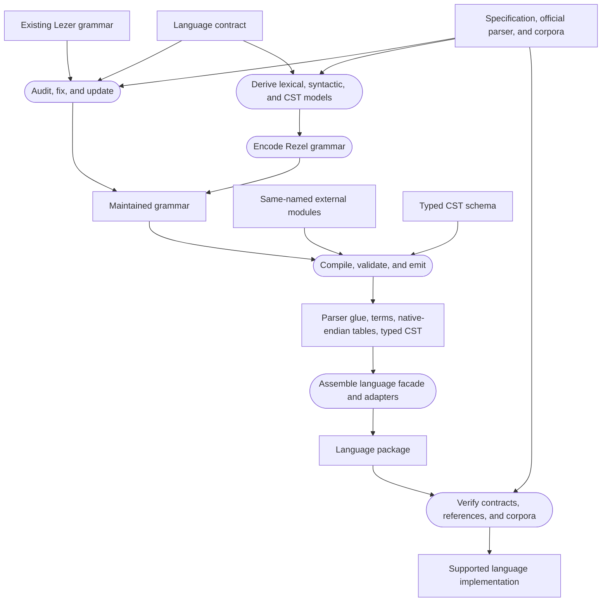

# Adding a language

A Rezel language package turns a language definition into a parser-facing Rust
API. The grammar is central, but it is only one input. A complete package also
defines its source coordinates, external lexical behavior, generated artifacts,
typed CST surface, validation evidence, and any optional AST or highlighting
layers.

## The end-to-end flow

There are two ways to obtain the initial grammar. Use an existing Lezer grammar
when one is available and suitable; derive a new grammar from the language
definition when it is not. Both paths converge before generation.

The rectangles are maintained inputs, intermediate artifacts, or delivered
outputs. Rounded nodes are operations. An owned AST and syntax highlighting
branch from the language package only when the language contract requires
them.

## Working sequence

1. [Define the language contract](01-language-contract.md). Choose the
   supported version, parser entry points, tree and coordinate contracts, and
   evidence for each claim.
2. Read [Grammar design foundations](grammar-design/README.md). It explains how
   character streams, regular tokens, context-free syntax, LR decisions, CST
   shape, recovery, and parser complexity fit together.
3. [Write or adapt the grammar](02-grammar-syntax.md). This chapter is the
   self-contained Rezel grammar guide; the linked Lezer guide provides deeper
   background.
4. [Create the package and generate its artifacts](03-package-and-generation.md).
5. [Implement language adapters](04-language-adapters.md) for behavior that is
   not regular or context-free.
6. [Define the typed CST](05-typed-syntax.md).
7. [Lower an owned AST](06-owned-ast.md) only when the package promises one.
8. [Verify the language](07-verification.md) at the grammar, runtime, tree,
   projection, reference, and corpus boundaries.

These steps are ordered by dependency, not by a requirement to finish each
document in isolation. Grammar and test cases usually evolve together. What
must remain stable is the direction of authority: maintained language inputs
produce generated parser artifacts, and evidence tests the resulting claims.

## Case studies

[Language adaptation case studies](case-studies/README.md) apply this workflow
to pinned upstream artifacts. They may use a specific language to make the
audit concrete, but they remain examples rather than general grammar rules or
claims that Rezel ships that language. The first study traces every external
declaration in a maintained JavaScript grammar through its source callback,
prospective Rust binding, and verification obligations. Its coverage table
also identifies the external forms that the grammar does not use.

## Existing grammar and new grammar

An existing Lezer grammar is a valuable maintained design. Pin its revision,
compile it with Rezel, port external behavior to Rust, and compare its CST with
the pinned parser. Then fix known defects and update the grammar for the
language version promised by the package. The inherited grammar is evidence
and implementation input; it does not override the language contract.

When no suitable Lezer grammar exists, begin with the language's character,
lexical, and syntactic models. Other parser grammars can reveal productions
and ambiguities, but parser-specific actions and tree construction should not
be copied blindly. Derive the Rezel grammar in testable vertical slices.

The official parser remains a design source, not merely a process queried for
acceptance or an AST. Read its maintained grammar or parser code, lexer, tests,
diagnostics, and tree construction to understand how it interprets the
language. Translate those decisions into Rezel's model instead of copying
implementation-specific control flow.

The [Lezer System Guide](https://lezer.codemirror.net/docs/guide/) explains the
parser model and original grammar notation. Its
[examples](https://lezer.codemirror.net/examples/) show small grammars,
precedence, indentation-sensitive tokenization, highlighting, and tree tests.
Rezel's generator, runtime, and tests define the behavior of this project.
