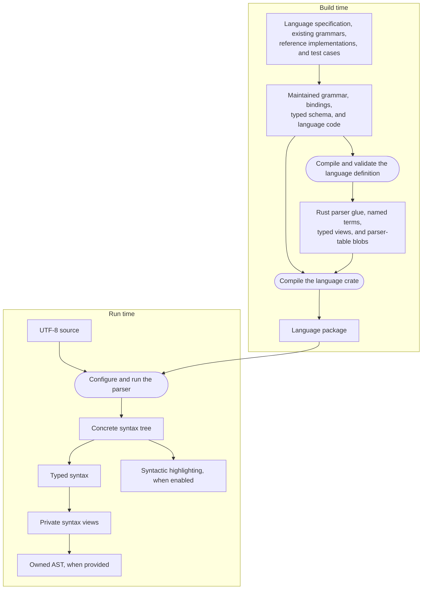

# Architecture

Rezel is an ahead-of-time parser system for Rust. A language package combines
a declarative grammar, generated LR/GLR tables, and the language-specific code
needed to interpret source text. Parsing produces a compact concrete syntax
tree that can be viewed through typed syntax, projected into an owned AST, or
used for syntactic highlighting.

The core design comes from Lezer: grammar compilation, contextual tokenization,
bounded GLR, error recovery, compact trees, and mixed parsing remain central to
the system. Rezel adapts that model to Rust, original UTF-8 byte coordinates,
Unicode code-point tokenization, statically linked callbacks, and checked-in
native parser data. Some input and tokenizer choices also draw on tree-sitter,
especially the separation between byte positions and code-point lookahead.
These relationships describe design ancestry, not API compatibility.

## System model

Rezel has a build-time flow and a run-time flow. The language package is the
boundary between them.

Rectangles are maintained data or produced artifacts. Rounded nodes are
operations. Reference tools and validation suites check both flows, but they
are not called when an application parses source text.

## Building a language package

A maintained language definition may contain three declarative inputs:

- a Lezer-style grammar describing tokens, productions, precedence, recovery,
  visible nodes, and grammar properties;
- a bindings manifest connecting grammar-declared externals to Rust symbols;
- a typed schema describing typed views over the visible CST.

The generator parses and validates these inputs, constructs token automata and
LR tables, and emits:

- Rust glue that defines a static `rezel_lr::Language`;
- constants for named grammar terms;
- zero-copy typed syntax wrappers;
- little-endian and big-endian native-layout parser-table blobs.

The target-endian blob is included as a typed static value at compile time.
There is no run-time table decoding or allocation. Generated language crates
therefore depend on `zerocopy` as well as `rezel-common` and `rezel-lr`.

Handwritten language code is compiled into the same crate. It supplies behavior
that should not be encoded in the generic runtime, such as input translation,
external tokenizers, parser contexts, strict validation, syntax normalization,
AST lowering, and language-specific highlighting configuration.

Generation is explicit rather than a hidden `build.rs` side effect. Generated
files and blobs are checked in, and package tests regenerate every artifact and
compare it with the committed result.

## Parsing source text

Public input is immutable UTF-8 text, and all public positions are byte offsets
in that original input. The language facade creates a parse request and may
attach a language-specific lexical view before invoking the generic LR
runtime.

```mermaid
flowchart LR
    Raw["Raw UTF-8 input"]
    Setup(["Language facade and input setup"])
    Logical["Logical code points with<br/>original byte boundaries"]
    Tokenize(["Generated and external tokenization"])
    Tokens["Tokens and parser context"]
    Parse(["LR/GLR actions and recovery"])
    CST["Compact CST with UTF-8 byte ranges"]
    Typed["Typed CST views"]
    Views(["Language-private syntax views"])
    AST["Owned AST, when provided"]
    Highlight["Syntactic highlight spans"]

    Raw --> Setup
    Setup --> Logical
    Logical --> Tokenize
    Tokenize --> Tokens
    Tokens --> Parse
    Parse --> CST
    CST --> Typed
    Typed --> Views
    Views --> AST
    CST --> Highlight
```

For ordinary UTF-8 input, the lexical view yields Unicode scalar values
directly. A language may translate source before tokenization while retaining
raw byte boundaries. Java, for example, applies its Unicode-escape rules in a
language-owned lexical view. UTF-16-specific behavior remains inside that Java
translation layer; the generic token DFA operates on `CodePoint` values.

Tokenization combines generated DFAs with statically bound external
tokenizers, specializers, and immutable context values. The runtime then
executes deterministic LR actions and explicitly permitted GLR splits. When
recovery is enabled it can skip or insert structure and records errors in the
tree. Strict mode rejects syntax errors instead.

`PartialParse` allows one parse to be advanced in resumable steps. Rezel does
not currently implement reuse of old tree fragments or changed ranges across
edits. Resumable execution of a single parse and incremental reuse between
different parses are separate capabilities.

## Syntax products

The CST is the common source-backed product. It preserves concrete grammar
structure, error nodes, node properties, and original source ranges.

Typed syntax is a generated, zero-copy view over that same tree. It gives
language-specific names and direct-child accessors without allocating another
tree.

Some owned ASTs need a shape that differs from the grammar-oriented CST.
Language-private syntax views normalize flattened, recursive, or
delimiter-sensitive productions for the lowerer. They are temporary views, not
another persistent representation. Owned ASTs are optional and are built only
from strict trees.

Highlighting is an independent projection from the CST. It uses syntax node
properties and selectors to produce abstract tags. It does not perform name
binding, scope analysis, type checking, or theme selection.

Mixed parsing is another CST-level composition. `rezel-common` can parse
selected ranges with another parser and mount the resulting trees as
replacements or overlays.

## Module boundaries

| Location                 | Responsibility                                                                                                                           |
| ------------------------ | ---------------------------------------------------------------------------------------------------------------------------------------- |
| `crates/rezel-common`    | Input and parser contracts, UTF-8 coordinates, compact immutable trees, typed-node traits, properties, mounts, and mixed parsing.        |
| `crates/rezel-lr`        | Static LR/GLR execution, token streams, recovery, parser contexts, dynamic precedence, strict mode, and resource limits.                 |
| `crates/rezel-generator` | Grammar parsing, token and LR automata, binding validation, typed-schema validation, Rust glue, parser-table blobs, and the `rezel` CLI. |
| `crates/rezel-highlight` | Abstract syntax tags, selectors, and mount-aware syntactic highlighting.                                                                 |
| `languages/*`            | Maintained language definitions, generated artifacts, public parser facades, language-specific adapters, projections, and package tests. |
| `tools/references/*`     | Pinned behavioral references, snapshots, conformance tooling, and broad-corpus runners.                                                  |

The runtime crates know how to parse a generated language, but they do not know
the lexical or semantic rules of any particular programming language. A new
language-specific exception belongs in its language package unless it reveals
a genuinely reusable parser capability.

## Validation boundary

Different checks protect different boundaries:

- generated-artifact tests protect the build-time transformation;
- contract and tree tests protect parser behavior and source coordinates;
- typed and lowering tests protect syntax projections;
- Lezer references check selected parser and CST behavior;
- official language implementations check acceptance or owned AST claims;
- conformance suites and standard libraries provide breadth.

The complete validation model is described in
[Validation](validation.md). Development commands and update procedures are in
[Development workflow](development.md).
