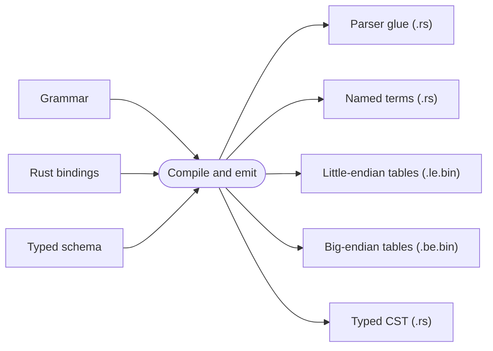

# Development

Rezel is developed as a Rust workspace with checked-in parser artifacts and
language-specific reference tools. A change is complete when its behavior,
generated outputs, and supporting evidence agree.

## Set up the workspace

Install [mise](https://mise.jdx.dev/) and then install the pinned tools:

```sh
mise install
```

The workspace pins dprint, Go, Java, Kotlin, Node.js, and Python in
[`mise.toml`](../mise.toml). The post-install hook also installs the Node.js
dependencies used by the Lezer reference runner and the traceability checker.
Rust is managed outside mise; use a toolchain capable of building the
workspace lockfile.

## Work from the narrowest feedback loop

Run the smallest test that can disprove the change while iterating:

```sh
cargo test --locked -p <package>
cargo test --locked -p <package> --test <test>
cargo test --locked -p <package> <test-name>
```

Before handing off a change, run the repository gate:

```sh
mise run verify
```

The normal gate checks formatting, Rust tests and doctests, API documentation,
Rust/Go/TypeScript lints, traceability manifests, and committed code-generated
artifacts. Changes that affect language conformance, parser references, or
broad source coverage should also run:

```sh
mise run verify:full
```

`verify:full` adds the extended JSON case, pinned reference comparisons, and
standard-library parsing. Individual tasks remain useful when diagnosing a
failure:

| Concern                      | Command                                                                            |
| ---------------------------- | ---------------------------------------------------------------------------------- |
| Formatting                   | `mise run format:check`                                                            |
| Workspace tests and doctests | `mise run test`                                                                    |
| Lints                        | `mise run lint`                                                                    |
| Rust API documentation       | `mise run docs`                                                                    |
| Traceability manifests       | `mise run alignment`                                                               |
| Pinned parser references     | `mise run reference:go`, `reference:javac`, `reference:cpython`, `reference:lezer` |
| Distribution corpora         | `mise run reference:distribution`                                                  |
| Standard-library corpora     | `mise run reference:stdlib`                                                        |

The task definitions in [`mise.toml`](../mise.toml) and Cargo aliases in
[`.cargo/config.toml`](../.cargo/config.toml) are the executable definitions of
these commands.

## Change the maintained input, then regenerate

Grammars, typed schemas, handwritten adapters, and reference scripts are
maintained inputs. Parser source, term constants, parser-table blobs, typed CST
wrappers, Unicode tables, and generated AST definitions are derived artifacts.

For a language parser, generation follows this shape:



Edit the maintained input rather than a generated file. Regenerate all outputs
from the same input, inspect the complete diff, and run the matching repository
code-generation check:

```sh
mise run codegen:rezel:<language>:update
mise run codegen:rezel:<language>
```

Both tasks call the centralized `rezel-codegen` tool. Update mode writes the
expected artifacts; check mode reconstructs them and compares them with the
committed files. The two parser-table blobs are part of that comparison: the
runtime selects the native-endian blob at compile time, so both representations
must remain current. `mise run verify` checks the full parser-artifact set when
every language's check task is explicitly present in its dependency list; it
does not discover new scopes automatically. No separate comparison test is
required in each package.

Some project data has a dedicated check/update pair:

```sh
mise run codegen:java-identifiers
mise run codegen:java-identifiers:update

mise run codegen:python-unicode
mise run codegen:python-unicode:update

mise run codegen:python-unicode-names
mise run codegen:python-unicode-names:update

mise run codegen:python-typed
mise run codegen:python-typed:update

mise run codegen:python-ast
mise run codegen:python-ast:update
```

Use an `:update` task only when changing its maintained source or intended
output. A generated diff is a review surface, not an error to accept
automatically.

## Test the contract at the owning layer

Place a test where the behavior is decided:

| Behavior                                   | Primary test                               |
| ------------------------------------------ | ------------------------------------------ |
| Generic tree, input, or parser mechanics   | Unit tests in `rezel-common` or `rezel-lr` |
| Grammar parsing, conflicts, and emission   | `rezel-generator` case and emission tests  |
| Public language parsing                    | Language contract and parse tests          |
| Generated files                            | Repository `codegen:rezel:*` check         |
| Typed CST navigation                       | Language typed-syntax tests                |
| Owned AST lowering                         | Lowering and AST projection tests          |
| Syntax highlighting                        | Highlight tests                            |
| Compatibility with an authoritative parser | Reference snapshots and differential tests |
| Behavior over many real files              | Corpus or standard-library runners         |
| Resource bounds and malformed input        | Limit, recovery, and adversarial tests     |

A `rezel-codegen` check proves reproducibility, not language correctness. A
reference comparison proves only the behavior represented by that reference.
Important language changes commonly need evidence at several layers.

## Work with references

The reference tools under [`tools/references/`](../tools/references) compare
selected Rezel behavior with pinned Lezer grammars or official language
implementations. Check tasks compare committed snapshots; update tasks replace
them:

```sh
mise run reference:lezer
mise run reference:lezer:update

mise run reference:go
mise run reference:go:update

mise run reference:javac
mise run reference:javac:update

mise run reference:cpython
mise run reference:cpython:update
```

Update a snapshot only after deciding that the new result is intended. Review
the minimal cases, version metadata, and resulting snapshot together. A pinned
Lezer tree can establish CST behavior; an official compiler or parser can
establish acceptance or AST behavior. Neither automatically defines every
layer of a language package.

Reference work also includes source study. When adding a language or explaining
a disagreement, inspect the targeted official implementation's lexer, parser,
diagnostics, tests, and AST construction instead of treating its command or API
as a black box. Record the revision and relevant implementation location when
that reading informs a grammar, adapter, validation, or lowering decision.

For broad coverage, the standard-library runners parse Go, Java, Kotlin,
Python, and Rust source trees. The Go, Java, and Python `:ast` variants compare
owned AST projections with the corresponding official implementation:

```sh
mise run reference:distribution:kotlin
mise run reference:stdlib:kotlin
mise run reference:stdlib:go:ast
mise run reference:stdlib:java:ast
mise run reference:stdlib:python:ast
```

These languages are current examples of the reference architecture. New
languages should choose an equivalent corpus and oracle suited to their own
contract.

## Keep traceability separate from behavior

Files under [`alignment/`](../alignment) record how selected implementation
areas relate to pinned upstream sources and where representations differ. Run
`mise run alignment` after changing a covered file, and update a manifest when
the mapping or rationale changes.

Traceability does not establish parser behavior. Pair it with focused tests,
reference comparisons, or corpus evidence as appropriate.

## Review performance changes

Measure a named boundary. Parser throughput should exclude AST lowering,
highlighting, and validation unless those operations are the subject of the
measurement. Record the corpus, build profile, machine, number of runs, and
measured results with the benchmark artifacts rather than in a commit message.

Prefer changes that remove a known operation, allocation, or representation
conversion. Re-run correctness gates before drawing performance conclusions;
faster behavior outside the language or safety contract is not an
optimization.

Performance commits follow the repository's
[commit-message policy](../CONTRIBUTING.md#write-performance-commits): their
bodies record the mechanism, eliminated work, preserved invariants, and
correctness evidence, while measured results remain with the benchmark output.
